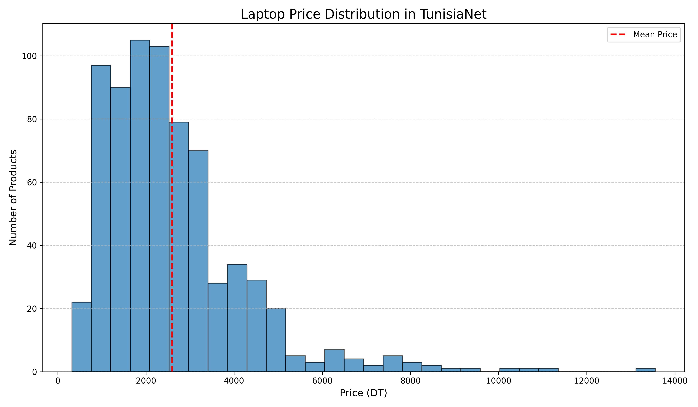

# 🚀 TunisiaNet Laptop Scraper

## 📊 Advanced Web Scraping Solution for Tech Products


## 🌟 Project Overview

`TunisiaNet Laptop Scraper` is an advanced web scraping tool designed to extract comprehensive product information from TunisiaNet's laptop catalog. This powerful Python script leverages Selenium to navigate, extract, and transform web data into multiple, easily consumable formats.

## ✨ Key Features

- 🔍 Comprehensive Product Scraping
  - Extract detailed laptop information
  - Navigate through multiple product pages
  - Handle dynamic web content

- 📦 Multiple Output Formats
  - JSON
  - CSV
  - Excel
  - Markdown Report
  - SQLite Database

- 📈 Advanced Data Visualization
  - Price distribution plot
  - Detailed statistical analysis

- 🛡️ Robust Error Handling
  - Comprehensive logging
  - Flexible data extraction

## 🛠 Prerequisites

- Python 3.8+
- Chrome Browser
- Chrome WebDriver

## 🚀 Quick Setup

1. Clone the Repository
```bash
git clone https://github.com/yourusername/Laptop-Scraper.git
cd Laptop-Scraper
```

2. Create Virtual Environment
```bash
python3 -m venv venv
source venv/bin/activate  # On Windows, use `venv\Scripts\activate`
```

3. Install Dependencies
```bash
pip install -r requirements.txt
```

## 🖥️ Usage

Run the scraper:
```bash
python scraper.py
```

## 📂 Project Structure
```
Laptop-Scraper/
│
├── scraper.py         # Main scraping script
├── requirements.txt   # Project dependencies
├── results/           # Output directory
│   ├── products.json
│   ├── products.csv
│   ├── products.xlsx
│   ├── products_report.md
│   └── price_distribution.png
│
└── logs/              # Logging directory
    └── tunisianet_scraper_TIMESTAMP.log
```

## 🎯 Output Examples

### 📊 JSON Sample
```json
{
        "title": "Pc Portable HP 15-Fd0051nk / I3-N305 / 32 Go / 512 Go SSD / Gold",
        "reference": "[A2AN9EA-32]",
        "description": "Écran Full HD 15.6\" (1920 x 1080), antireflet - Processeur Intel Core i3-N305, (jusqu’à 3.8 GHz, 6 Mo de mémoire cache) - Mémoire 32 Go DDR4 - Disque SSD NVMe M.2 512 Go - Carte graphique Intel UHD Intégré - Wi-Fi 6 - Bluetooth 5.3 - Clavier complet gris clair avec pavé numérique - Caméra HP True Vision HD 720p - Doubles haut-parleurs - 1x USB-C - 2x USB-A - 1x HDMI 1.4b - 1x prise combinée casque/microphone - FreeDOS - Couleur Gold - Garantie 1 an",
        "price": "1 305,000 DT",
        "availability": "En stock",
        "img_url": "https://www.tunisianet.com.tn/401810-home/pc-portable-dell-vostro-3530-i3-1305u-24-go-512-go-ssd-noir.jpg"
    }
```

### 📈 Price Distribution Visualization


### 📄 Markdown Report Snapshot
- **Total Products:** 714
- **Price Analysis:**
  - Minimum Price: 500 DT
  - Maximum Price: 13000 DT
  - Average Price: 1500 DT

## 🤝 Contributing

1. Fork the repository
2. Create your feature branch
3. Commit your changes
4. Push to the branch
5. Create a Pull Request

## ⚠️ Disclaimer

This tool is for educational purposes. Always respect website terms of service and robots.txt.

## 📜 License

MIT License


---

**Happy Scraping! 🕷️📊**